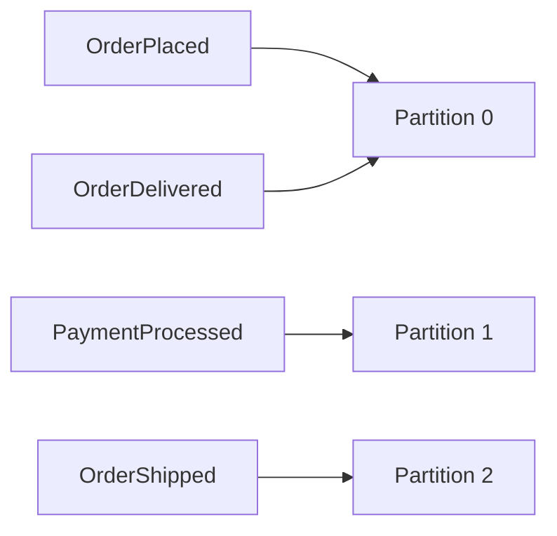
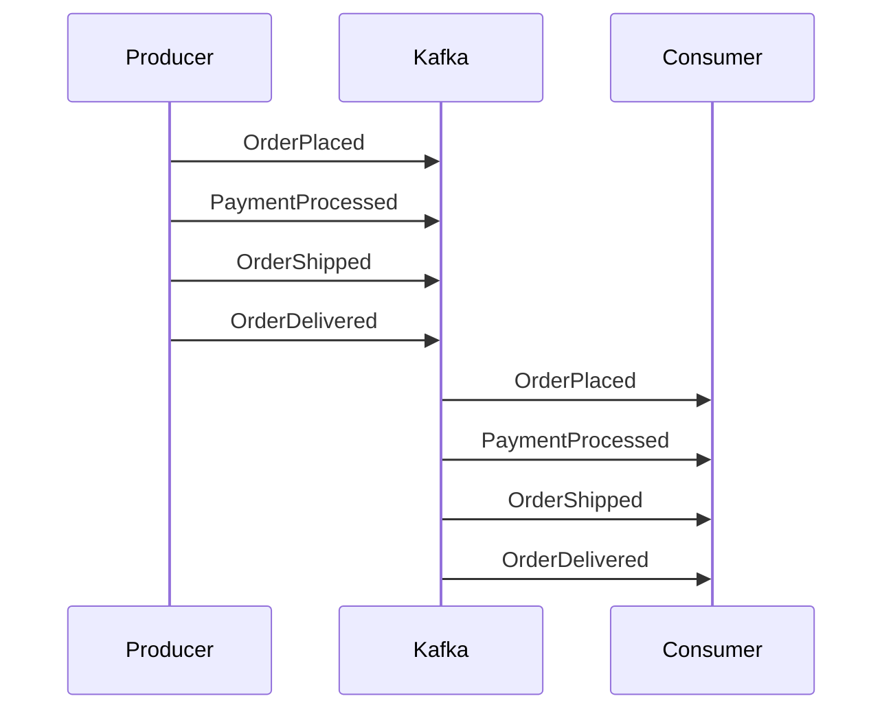
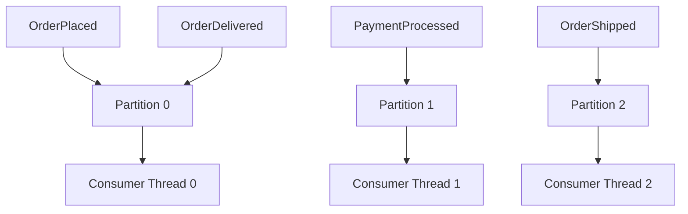
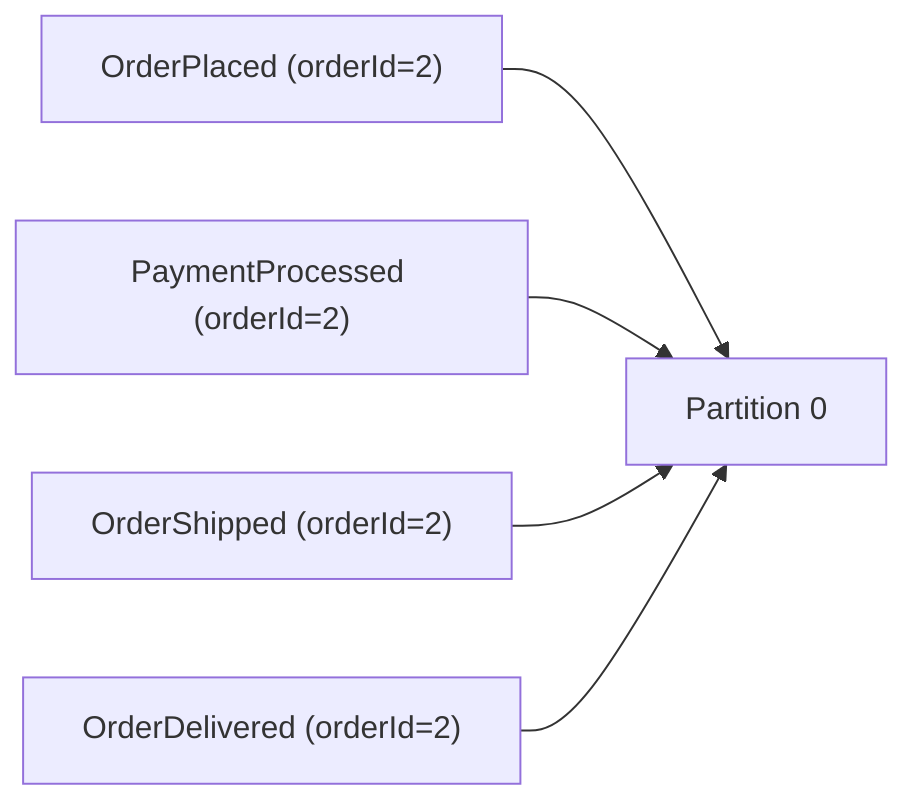
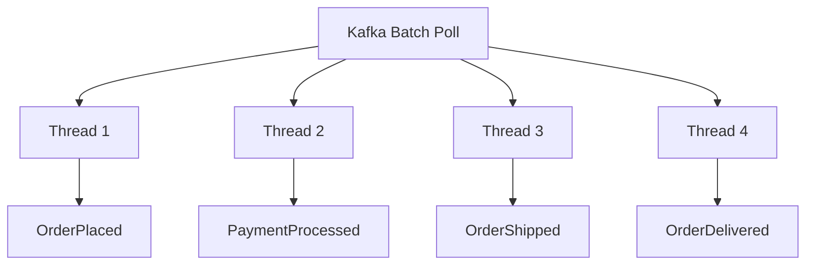
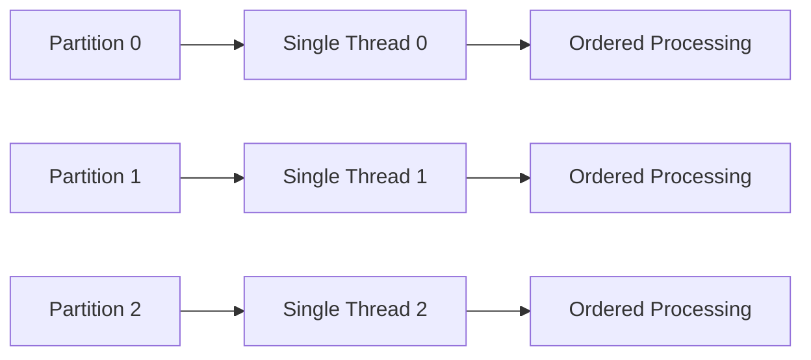

# Kafka Message Ordering - Spring Boot

## Overview

Apache Kafka guarantees ordering **only within a single partition**.

If related messages are distributed across multiple partitions, ordering can break.

This project demonstrates:

- Kafka ordering guarantees
- Producer-side ordering problems
- Consumer-side ordering problems
- Sticky partitioning
- Partition-based thread execution
- High-throughput ordered processing

---

# Kafka Ordering Problem

Kafka preserves ordering only **inside a single partition**.

If related events go to different partitions, consumers process them independently, causing ordering issues.

## Visualization



---

# Ecommerce Order Lifecycle Example

A single ecommerce order usually goes through multiple stages:

- OrderPlaced
- PaymentProcessed
- OrderShipped
- OrderDelivered

These events must always be processed in the same order.

## Correct Ordering



---

# Why Ordering Breaks

## Important Correction

Kafka does **NOT** use round-robin partitioning by default anymore.

Modern Kafka producers use:

# Sticky Partitioning

Kafka:

- Picks a partition
- Sticks to it temporarily
- Fills batches efficiently
- Then rotates partitions

This improves batching and throughput.

However, related events may still land in different partitions, causing ordering issues.

---

# Broken Ordering Example



---

# Broken Event Sequence

Expected:

```text
OrderPlaced
PaymentProcessed
OrderShipped
OrderDelivered
```

Possible Actual Processing:

```text
PaymentProcessed
OrderPlaced
OrderDelivered
OrderShipped
```

---

# Event Model

```java
public record OrderEvent(
    String orderId,
    int seq,
    String eventType,
    Instant ts
) {}
```

---

# Producer-Side Solution

Use a fixed key so Kafka hashes related events into the same partition.

In this project:

- `orderId` is used as the Kafka message key
- All events for the same order go to the same partition
- Ordering is preserved

## Visualization



---

# Demo Endpoints

Use these endpoints to visualize ordering behavior:

```text
/demo/no-key
/demo/with-key
```

- `/demo/no-key`
  - Events are sent without a key
  - Ordering may break

- `/demo/with-key`
  - `orderId` is used as the key
  - Ordering is preserved

---

# Consumer-Side Ordering Problem

Even if the producer sends ordered events to the same partition, ordering can still break on the consumer side.

This project simulates this using:

```java
OrderEventConsumerParallel
```

The consumer processes records concurrently using multiple threads.

## Parallel Processing Snippet

```java
executor.submit(() -> {
    // process event
});
```

And the listener is configured as:

```yaml
spring:
  kafka:
    listener:
      type: BATCH
```

---

# Why Consumer Ordering Breaks

Batch records are processed in parallel.

Different threads may finish execution in different orders.

## Visualization



---

# Bad Solution

Consume only one record at a time.

## Configuration

```yaml
max.poll.records: 1
```

## Problem

This preserves ordering but:

- Kills concurrency
- Reduces throughput
- Slows down processing significantly

---

# Better Solution - Partition Affinity Threads

Assign a dedicated thread per partition.

Example:

- Partition 0 -> Thread 0
- Partition 1 -> Thread 1
- Partition 2 -> Thread 2

This preserves ordering per partition while maintaining high throughput.

## Implementation Snippet

```java
Map<Integer, ExecutorService> partitionExecutors =
        new ConcurrentHashMap<>();

partitionExecutors
    .computeIfAbsent(
        record.partition(),
        p -> Executors.newSingleThreadExecutor()
    )
    .submit(() -> {
        // process event
    });
```

---

# Visualization - Partition Affinity



---

# Final Takeaways

- Kafka guarantees ordering only within a partition
- Sticky partitioning improves batching but does not guarantee entity ordering
- Use a message key (`orderId`) to preserve ordering
- Consumer-side parallelism can still break ordering
- `max.poll.records=1` is safe but slow
- Partition-affinity thread models preserve both ordering and throughput